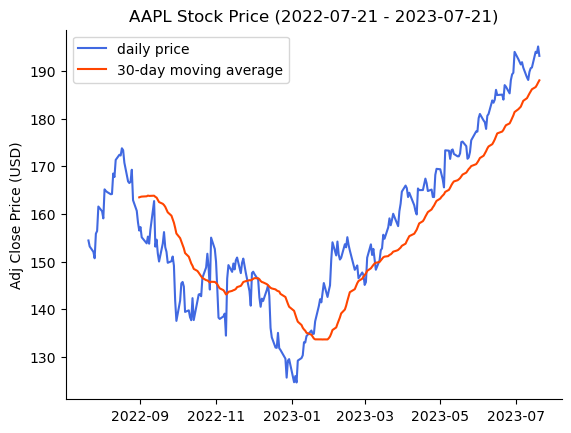
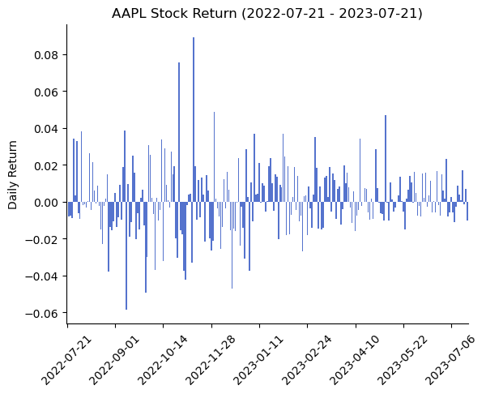

# easystockplot - An easy Python plot package for stocks!

## Overview
**easystockplot** is a Python package that allows users to easily plot the daily stock price and return of a stock over the past year by default. You can also specify the period (by specifying `end_date` and `number of days`) of the stock you want to plot.

## Installation
To download easystockplot, either fork this github repo or simply use Pypi via pip.

```bash
pip install easystockplot
```

## Usage 

### Import the package
```python
from easystockplot import StockPlot
```

### Plot the daily stock price and 30-day moving average over the past year

```python
Apple_plot = StockPlot('AAPL')

Apple_plot.plot_stock()
```


### Plott the daily stock return over the past year
```python
Apple_plot.plot_stock_return()
```


